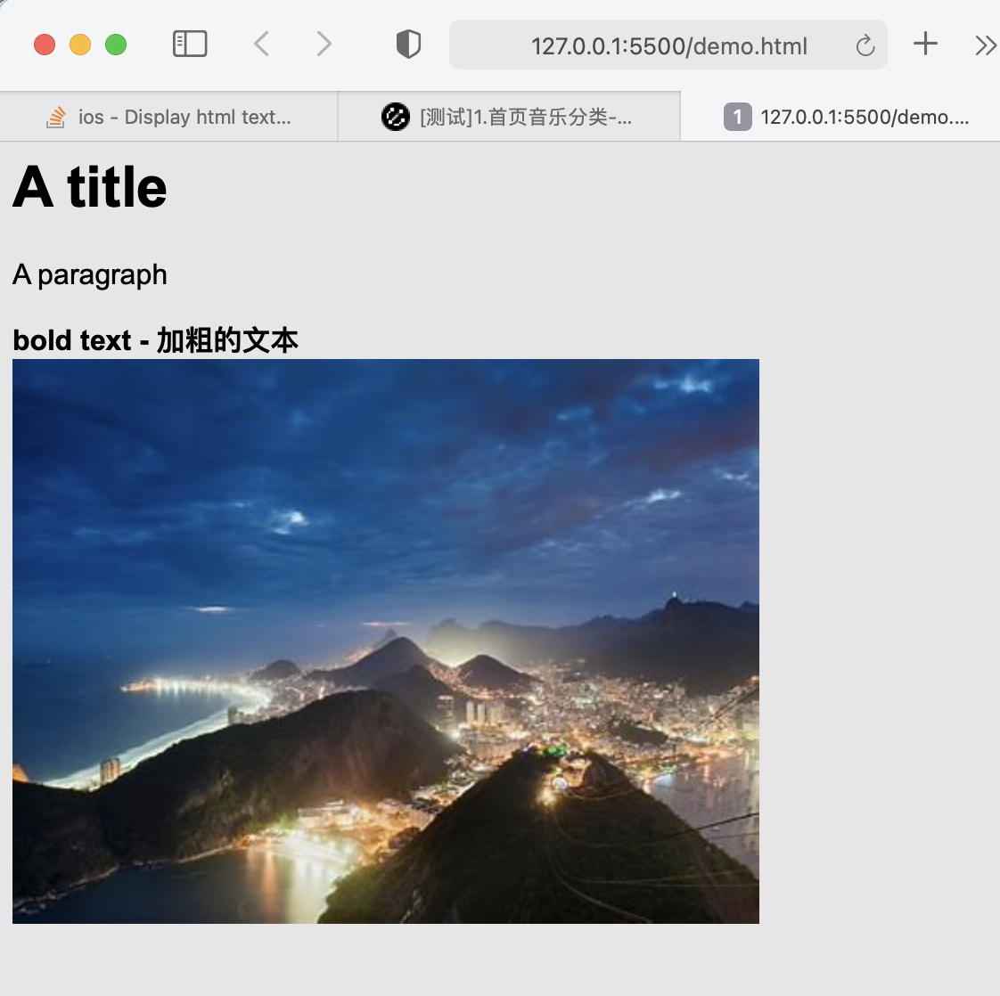

# UITextView加载html类型的文本内容

> 之前一直以为iOS的原生文本对html支持差，最近google了一下，才发现竟然只需要几行代码，效果也不错

html源码：

```html
<html>
    <head>
        <style>
            body {
                background-color : rgb(230, 230, 230);
                font-family      : 'Arial';
                text-decoration  : none;
            }
        </style>
    </head>
    <body>
        <h1>A title</h1>
        <p>A paragraph</p>
        <b>bold text - 加粗的文本</b>
        
    </body>
</html>
```

在浏览器中的效果：



在iPhone上的展示效果：


下面是转换的代码：

```swift
        let htmlString = """
            ...
            """

        let htmlData = NSString(string: htmlString).data(using: String.Encoding.unicode.rawValue)

        let options = [NSAttributedString.DocumentReadingOptionKey.documentType: NSAttributedString.DocumentType.html]

        let attributedString = try! NSAttributedString(data: htmlData!, options: options, documentAttributes: nil)

        textView.attributedText = attributedString
```


refer to:https://stackoverflow.com/questions/2454067/display-html-text-in-uitextview/20996085

